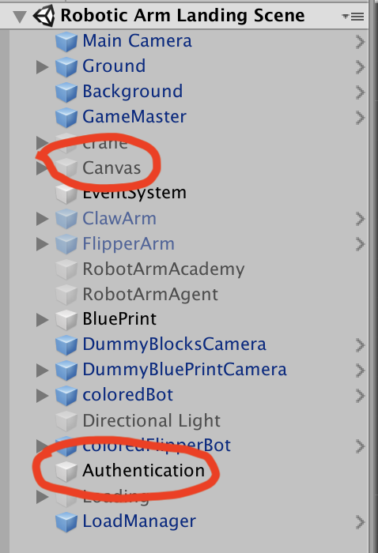

# Reverse Angry Bird

## Tools & Version
Unity Version: 2019.1.8f1 \
Burst Version 1.1.1

## Important note
The project is set up for the WebGL. Enable to run in the Unity editor have to disable the authentication set up
Go to Landing Scene => Set Authentication to not active and set Canvas to active \


## How to use
```git clone ~ ``` \
```open Unity hub ```\
```use Unity hub to open the folder```

## Docs
[Data transfer on WebGL](https://github.com/JCTGY/rabshare/blob/master/Data%20Transfer%20WebGL%20to%20Google%20Cloud.pdf)
